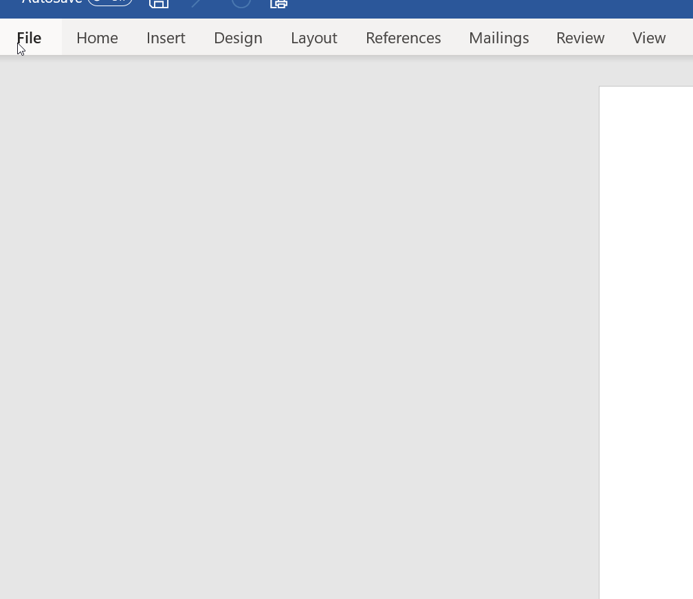
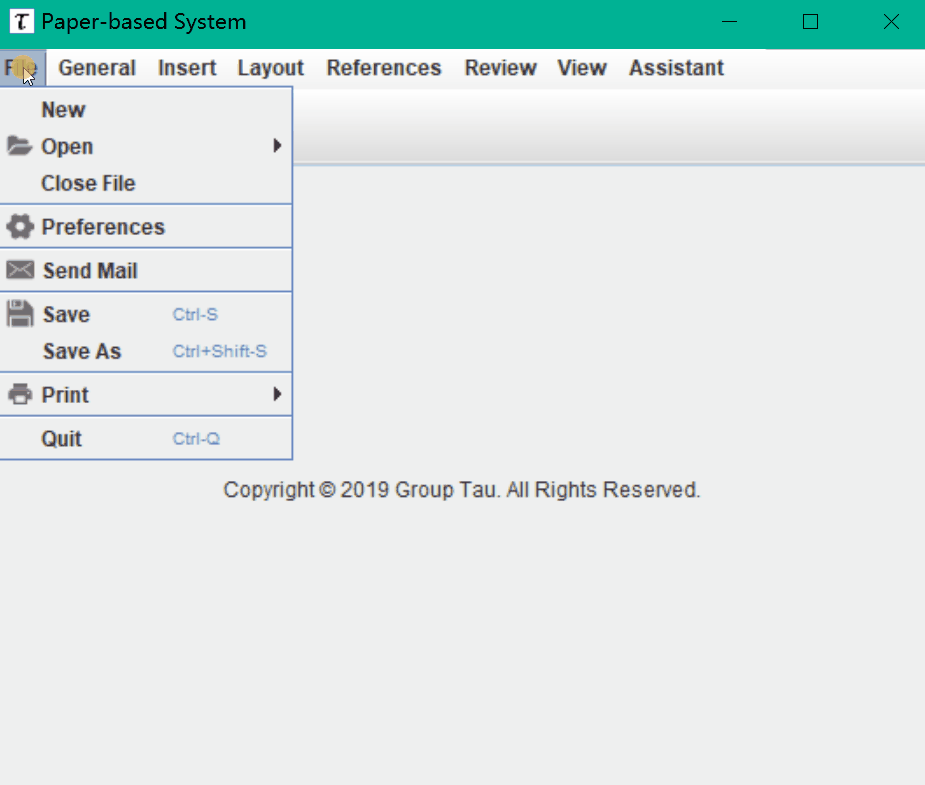

   # Menu Demo
**Microsoft Word**
<p align="center"></p>

**Menu**
<p align="center"></p>

# A Simple Menu Layout Design
[](https://github.com/Hephaest/MenuInWordFormat/blob/master/LICENSE)
[](https://www.oracle.com/technetwork/java/javase/8u202-relnotes-5209339.html)
[](https://github.com/Hephaest/MenuInWordFormat/tree/master/src)

English | [中文](README_CN.md)

This project was small coursework from the CNSCC.202: Human-Computer Interaction (Lancaster University).<br>
The task of this coursework only asks for function grouping but not need any coding work.<br>
In order to express the design principles of my team, I decided to make this menu.

The functions we needed to sort has been listed as follows:
<p align="center"></p>

# Function grouping Principle
## Functionality
Controls and displays are organized so that those that are `functionally related are placed together`.
- e.g. plain text, bold text, italic text and underline text.
## Sequence
Controls and displays are organized to `reflect the order` of being used in a typical operation.
- e.g. first copy then paste.
## Frequency
Controls and displays are organized according to `how frequently they are used`, with the most commonly used controls being the most easily accessible.
- e.g. save and print.

# Design Principle
## Fitts' law
The target as large as possible, the distance as small as possible.
## Human mistakes
e.g., the user wants to save the document but he may think that “save as” is “save” function because he finds it at first and he isn’t sure whether there is a “save” button if we don’t grouping functions.
## Human slips
e.g., the users could accidentally press the “delete” rather then “paste” if functions are not appropriately grouped.

# Java Implementation
Inspired by Microsoft Word styles and above principles, my final design was to use large icons to decorate the common operations.
In addition, these operations were wrapped in pop-up submenus.<br>
**Submenus** are achieved by `JToolBar` once the user clicks one of them, another should be remove from `JFrame`.<br>
For example,
```Java
public void menuSelected(MenuEvent e) {
    if(toolbar != null) {
        toolbar.setVisible(false);
        frame.remove(toolbar);
    }
    if(viewbar == null) {
        viewbar = new JToolBar();
        JMenuBar menuBar = new JMenuBar();
        // Page
        ImageIcon pageIcon = new ImageIcon("src/images/page.png");
        JMenu page = new JMenu("View Page");
        page.setIcon(pageIcon);
        menuBar.add(page);

        // Position on page
        ImageIcon posIcon = new ImageIcon("src/images/position.png");
        JMenu position = new JMenu("Position");
        position.setIcon(posIcon);
        menuBar.add(position);

        // Show document
        ImageIcon docIcon = new ImageIcon("src/images/documents.png");
        JMenu document= new JMenu("Alternative Document");
        document.setIcon(docIcon);
        menuBar.add(document);

        viewbar.add(menuBar);
    }
    frame.add(viewbar, BorderLayout.PAGE_START);
    viewbar.setVisible(true);
    frame.setVisible(true);
}
```
As for **shortcuts**, we need to invoke `setAccelerator()` function to set our own shortcuts.<br>
For example,
```Java
toolItem = new JMenuItem("Delete");
toolItem.setAccelerator(javax.swing.KeyStroke.getKeyStroke(java.awt.event.KeyEvent.VK_DELETE, 0));
```
Further, we need to add an appropriate icon aside with each button to help users understand what they can do.<br>
The implementation is quite simple:
```Java
ImageIcon pageIcon = new ImageIcon("src/images/page.png");
JMenu page = new JMenu("View Page");
page.setIcon(pageIcon);
```
The full source code can be viewed by clicking [here](https://github.com/Hephaest/MenuInWordFormat/blob/master/src/MyMenu.java).
 
