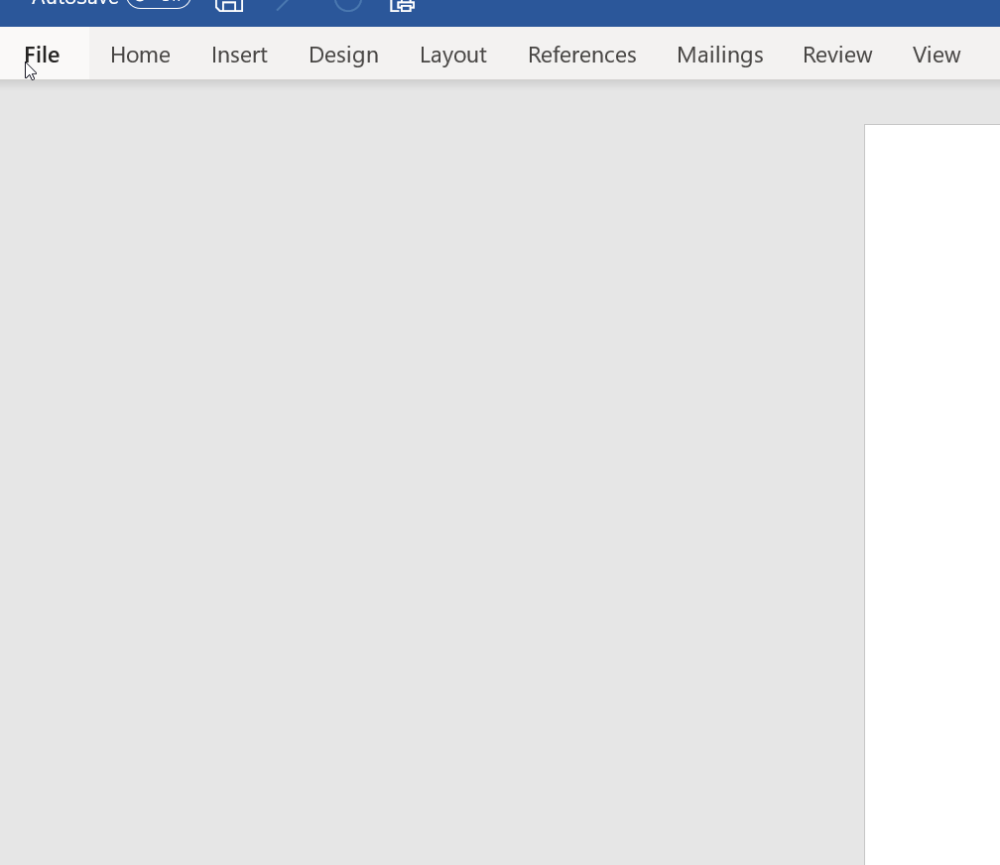
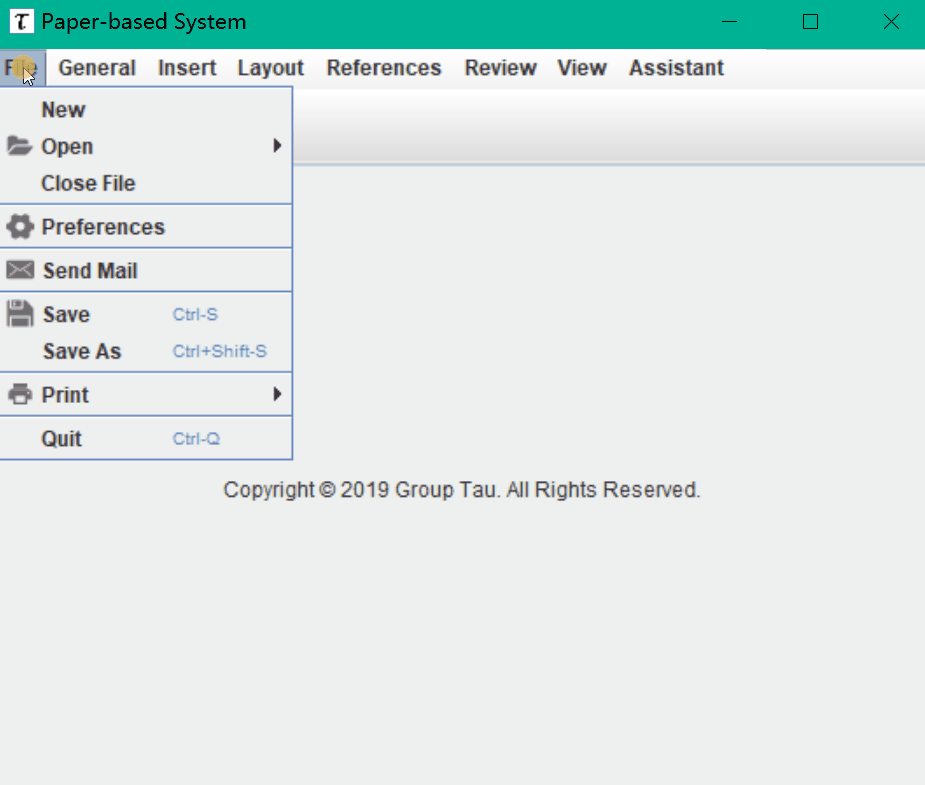
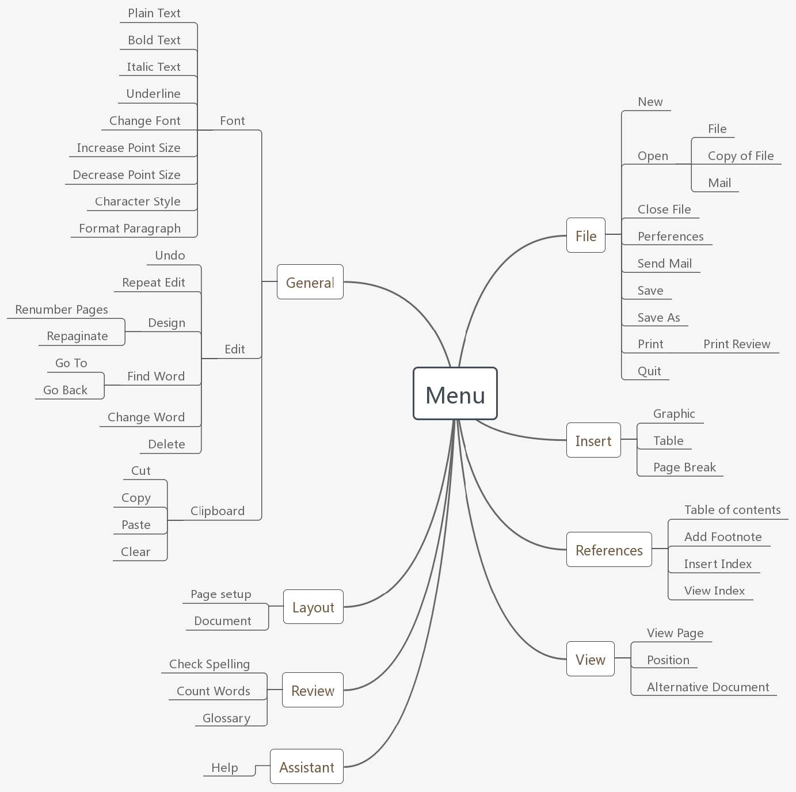

目录
=================
   * [菜单效果演示图](#菜单效果演示图)
   * [简单的菜单布局设计](#简单的菜单布局设计)
   * [功能分组原理](#功能分组原理)
      * [功能性](#功能性)
      * [时序性](#时序性)
      * [使用频率](#使用频率)
   * [菜单设计原理](#菜单设计原理)
      * [费茨法则](#费茨法则)
      * [人类是会犯错误的](#人类是会犯错误的)
      * [人类的失误](#人类的失误)
   * [Java 编程实现](#java-编程实现)
   
# 菜单效果演示图
**Microsoft Word**
<p align="center"></p>

**本程序菜单**
<p align="center"></p>

# 简单的菜单布局设计
[](https://github.com/Hephaest/MenuInWordFormat/blob/master/LICENSE)
[](https://www.oracle.com/technetwork/java/javase/8u202-relnotes-5209339.html)
[](https://github.com/Hephaest/MenuInWordFormat/tree/master/src)

[English](README_CN.md) | 中文

最后一次更新于 `2019/07/09`

这个项目是 CNSCC.202: 人机交互设计课程 的一个小作业。<br>
不过该作业的要求是不需要编写任何代码的。<br>
但为了体现我们小组的设计和分组理念，我还是决定编写一个菜单小程序，该程序有灵活的布局，是微软的 Word 编辑器和 IntelliJ IDEA 编辑器布局的综合。

我们小组需要处理的所有功能已经预先被分类成如下几种名称：
<p align="center"></p>

# 功能分组原理
## 功能性
根据 `功能相似的应该放在一起` 的原则来布局所属的按钮。
- 例如，空白文本，加粗文本，斜体文本和下划线文本。
## 时序性
根据 `功能的分组可以反应执行的顺序` 的原则来布局所属的按钮。
- 例如，先复制后粘贴。
## 使用频率
根据 `使用频率相似的功能应该放在一起` 的原则来布局所属的按钮。通常常用操作都会在工具栏里使用户能直接点击。
- 例如，保存和打印。

# 菜单设计原理
## 费茨法则
按钮的面积越大越好。而用户的鼠标指针和按钮之间的距离越小越好。因为这意味着用户实现功能的时间变少。
## 人类是会犯错误的
设计过程中要尽量避免误导用户。<br>
比如说，如果先使用户看到“保存为”功能而不是“保存”功能的话很可能使用户误认为“保存为”即是“保存”功能。
## 人类的失误
设计过程中要尽量避免用户意外点中不相关的功能。<br> 
比如说，用户可能误点中“删除”而不是“粘贴”如果这两个功能紧挨在一起的话。

# Java 编程实现
从各类文本编辑器和以上原理的灵感激发下，我觉得做出灵活布局的菜单。<br>
常见的操作会用工具栏来实现，它们被包裹在子菜单中。<br>
**子菜单** 可以利用 `JToolBar` 实现，当用户点击其他的子菜单时当前显示的子菜单应从 `JFrame` 移除。<br>
举个例子
```Java
public void menuSelected(MenuEvent e) {
    if(toolbar != null) {
        toolbar.setVisible(false);
        frame.remove(toolbar);
    }
    if(viewbar == null) {
        viewbar = new JToolBar();
        JMenuBar menuBar = new JMenuBar();
        // 页面。
        ImageIcon pageIcon = new ImageIcon("src/images/page.png");
        JMenu page = new JMenu("View Page");
        page.setIcon(pageIcon);
        menuBar.add(page);

        // 页面所在位置。
        ImageIcon posIcon = new ImageIcon("src/images/position.png");
        JMenu position = new JMenu("Position");
        position.setIcon(posIcon);
        menuBar.add(position);

        // 显示文档。
        ImageIcon docIcon = new ImageIcon("src/images/documents.png");
        JMenu document= new JMenu("Alternative Document");
        document.setIcon(docIcon);
        menuBar.add(document);

        viewbar.add(menuBar);
    }
    frame.add(viewbar, BorderLayout.PAGE_START);
    viewbar.setVisible(true);
    frame.setVisible(true);
}
```
对于**快捷键**的实现而言，我们需要调用 `setAccelerator()` 函数来设置快捷键。<br>
比方说，
```Java
toolItem = new JMenuItem("Delete");
toolItem.setAccelerator(javax.swing.KeyStroke.getKeyStroke(java.awt.event.KeyEvent.VK_DELETE, 0));
```
接着，我们应该为每个按钮设置一个图标以此来提醒用户点击该按钮会发生什么。<br>
这部分的实现比较简单：
```Java
ImageIcon pageIcon = new ImageIcon("src/images/page.png");
JMenu page = new JMenu("View Page");
page.setIcon(pageIcon);
```
完整代码可通过点击 [这里](https://github.com/Hephaest/MenuInWordFormat/blob/master/src/MyMenu.java) 获取。
 
